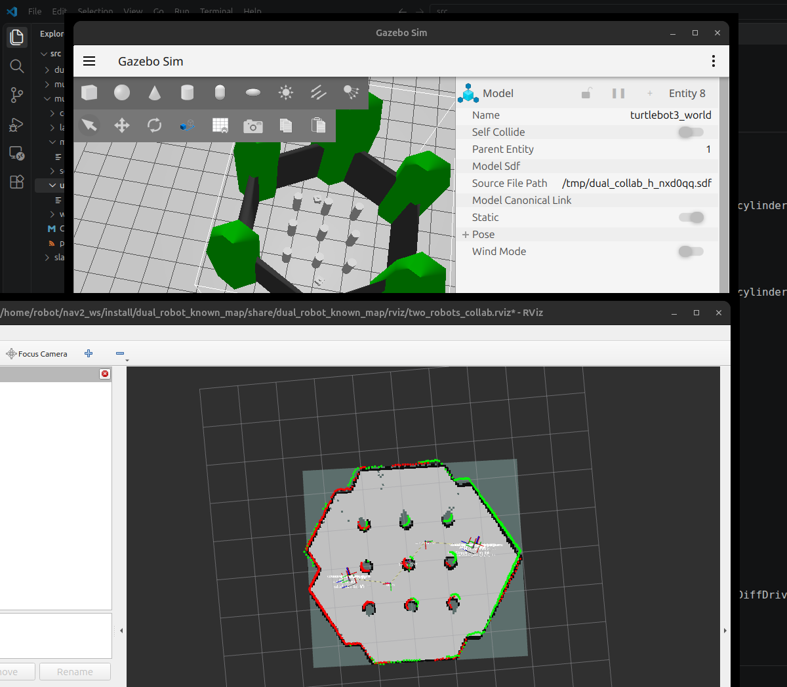
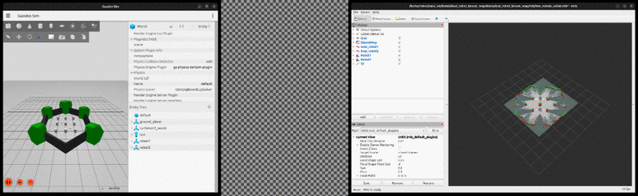

# Multi-Robot Collaborative SLAM (ROS 2)

Two or **four** TurtleBot3 robots in **one Gazebo world**, **Macenski-style decentralized slam_toolbox**, and **one shared RViz** showing all robots and a collaborative map.



*Gazebo (left) and one shared RViz (right): both robots mapping the TB3 sandbox together.*

**Demo (~11s, plays inline)** — both robots drive on diverging open-space lanes while the shared map fills in:



<details>
<summary>MP4 download (same clip)</summary>

[docs/multi_robot_slam_demo.mp4](docs/multi_robot_slam_demo.mp4)

</details>

This is **not** the official “one RViz per robot” Nav2 demo. It wires the industry pattern (namespaced TF + `/localized_scan` sharing) into a single operator view.

## Features

- One Gazebo world, **one `/clock` bridge** (no dual-clock TF fighting)
- Per-robot sensor bridges (scan, odom, cmd_vel)
- **Decentralized multi-robot slam_toolbox** (`decentralized_multirobot_slam_toolbox_node`)
- Shared scan topic: `/localized_scan`
- Shared odometry frame: `global_odom` (static `global_odom → odom` at each spawn)
- **One RViz**: robot1 TF tree + peer TF/scan relays so **all robots** appear
- Collaborative map on `/robot1/map` (all robots contribute when driven)
- **House world** (~12×12 m, 4 rooms + boxes) for the 4-robot launch

## Package

| Path | Role |
|------|------|
| `src/dual_robot_known_map` | Launch, bridges, relays, RViz configs |

### Launches

| Launch | Description |
|--------|-------------|
| `four_robots_collab_slam.launch.py` | **Main:** 4 robots in house (rooms+boxes), collab SLAM + one RViz |
| `two_robots_collab_slam.launch.py` | 2 robots in TB3 sandbox, collab SLAM + one RViz |
| `two_robots_known_map.launch.py` | Known map only (no SLAM), both robots in one RViz |
| `two_robots_slam.launch.py` | Independent SLAM per robot (two maps overlaid) |

## Dependencies

- ROS 2 **Jazzy**
- Gazebo Harmonic (`ros_gz_sim`, `ros_gz_bridge`)
- `nav2_minimal_tb3_sim`, `nav2_map_server`, `nav2_lifecycle_manager`, `rviz2`, `tf2_ros`
- **slam_toolbox** built with the **decentralized multi-robot** node  
  (stock apt `slam_toolbox` on Jazzy may not ship `decentralized_multirobot_slam_toolbox_node`)

Build / overlay a slam_toolbox that includes:

```text
decentralized_multirobot_slam_toolbox_node
```

Example (if you already have that workspace):

```bash
source ~/slam_multi_ws/install/setup.bash
```

## Build

```bash
mkdir -p ~/multi_robot_slam_ws/src
cp -r src/dual_robot_known_map ~/multi_robot_slam_ws/src/
cd ~/multi_robot_slam_ws
source /opt/ros/jazzy/setup.bash
# also source your slam_toolbox overlay if needed
colcon build --packages-select dual_robot_known_map --symlink-install
source install/setup.bash
```

## Run (4-robot house collaborative SLAM)

Compact **~12×12 m** house (4 rooms, doorways, boxes). No Fuel download.

```bash
source /opt/ros/jazzy/setup.bash
source ~/slam_multi_ws/install/setup.bash   # decentralized slam_toolbox
source ~/multi_robot_slam_ws/install/setup.bash

ros2 launch dual_robot_known_map four_robots_collab_slam.launch.py
```

Spawns (one robot per room):

| Robot | Pose (x, y, yaw) | Room |
|-------|------------------|------|
| robot1 | (-3, -3, 0) | SW |
| robot2 | (3, -3, π) | SE |
| robot3 | (-3, 3, 0) | NW |
| robot4 | (3, 3, π) | NE |

### Drive robots

**Safe four-robot demo** — each drives body-forward so they fan away from the center aisle:

```bash
python3 scripts/drive_four_demo.py
# or: ros2 run dual_robot_known_map drive_four_demo.py
```

**2-robot sandbox** (smaller TB3 world):

```bash
ros2 launch dual_robot_known_map two_robots_collab_slam.launch.py
python3 scripts/drive_both_demo.py
```

Or teleop each robot:

```bash
# Robot 1
ros2 run teleop_twist_keyboard teleop_twist_keyboard --ros-args -r __ns:=/robot1 -p stamped:=false

# Robot 2 (other terminal)
ros2 run teleop_twist_keyboard teleop_twist_keyboard --ros-args -r __ns:=/robot2 -p stamped:=false
```

Use `stamped:=false` — the Gazebo bridge expects `geometry_msgs/Twist`, not `TwistStamped`.

Keys: `i` forward, `,` back, `j`/`l` turn, `k` stop.

### Record a short demo video

With Gazebo + RViz visible on `:0`:

```bash
# terminal A — record side-by-side windows (~11s)
python3 scripts/record_demo_windows.py --out docs/multi_robot_slam_demo.mp4 --seconds 11

# terminal B — drive both at the same time
python3 scripts/drive_both_demo.py
```

### RViz tips

- Fixed frame: start with `global_odom`; switch to `map` once SLAM has published `map → global_odom`
- Shared map topic: `/robot1/map`
- Both robots should appear (robot2 via TF relay)

## Design notes (why this works)

1. **Single `/clock`** — only one process bridges Gazebo clock; per-robot bridges omit clock.
2. **Namespaced TF for SLAM** — each robot has `/robotN/tf` so both can publish `map → global_odom` without colliding.
3. **One RViz** — remapped to `/robot1/tf`; `peer_tf_relay` copies robot2 body frames in under `robot2/…`.
4. **Collaborative map** — robots exchange `LocalizedLaserScan` on `/localized_scan`; each slam instance maintains a global map (view `/robot1/map`).

## License

Apache-2.0 (package); TurtleBot / Nav2 assets remain under their upstream licenses.

## Four-robot Nav2 (known map)

After collaborative SLAM, run Nav2 on the saved house map (one stack per robot, auto initial pose from spawn):

```bash
ros2 launch dual_robot_known_map four_robots_nav2.launch.py
```

Map: `src/dual_robot_known_map/maps/house_collab.yaml`. RViz Fixed Frame: `map`. Use the per-robot Goal tools (`/robot1/goal_pose` … `/robot4/goal_pose`).

